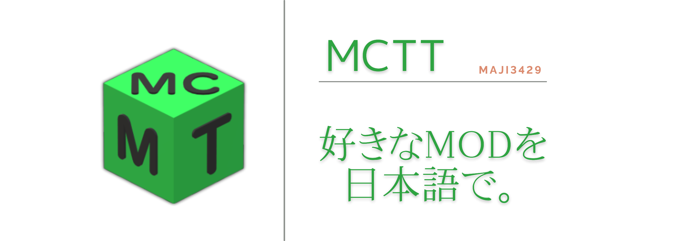

# 注意: このリポジトリは近日、大幅な変更を予定しており、リポジトリ全体として整っていません。リリースにある実行ファイルやこのリポジトリのコードベースの扱いは慎重に行ってください。
# CAUTION: This repository is undergoing significant changes in the near future, and the overall repository is not yet organized. Please exercise caution when handling the executable files in the releases or the codebase of this repository.

# **MineCraft-Mod-Translate-Tool**

  

Minecraft Java Edition の一部の MOD を簡単に翻訳するリソースパックを作成できます。  
最新版ダウンロード: https://github.com/Maji3429/Minecraft_Mod_Translate_tool/releases/latest

## 🚀 使い方

1. Releases からファイルをダウンロードして任意のフォルダーの中に配置してください。(起動時に`logs`フォルダや`temp`フォルダが作成されます)または自分でコンパイルすることもできます。
2. ソフトを起動します。
3. **設定アイコン**をクリックして、OpenRouter APIキーとモデルを設定します。
   - [OpenRouter](https://openrouter.ai/)で無料アカウントを作成しAPIキーを取得
   - 「モデルを取得」ボタンで利用可能なモデルを表示
   - 無料モデルまたは有料モデルから選択
   - （オプション）レート制限時用のフォールバックモデルを追加
4. 翻訳する MOD のバージョンを選択します。
5. 手動でファイルを選択します。もしくは、`mods`フォルダーのパスをクリップボードにコピーしてボタンをクリックし、**しばらくまつと**翻訳が開始されます。
6. 翻訳が完了するまで待ってください。
7. 実行ファイルと同じ階層に `translate_rp` というフォルダがあるのでマインクラフト内でリソースパックとして読み込ませてください。
8. MOD で追加されたアイテムの名前などが翻訳されます。

## ⚡️ 注意点

> [!CAUTION]
>
> -   このソフトウェアは、個人の使用を目的として作成されたものであり、非公式です。
> -   本ソフトウェアの使用により発生したいかなる損害や問題について、作成者は一切の責任を負いません。
> -   使用は自己責任で行ってください。
> -   翻訳したファイルは個人使用にしてください。配布はご遠慮ください。

-   言語ファイルを持たない MOD は翻訳できません。(Essential Mod など)
-   Bedrock 版のアドオンや、Lunar Client のようなどのクライアントは翻訳できません。比較的新しいバージョンの Java Edition MOD のみ翻訳できます。
-   **最初のバージョン選択画面に自分の使用したい MOD のマインクラフトバージョンがない場合は、ツールに表示されている中で一番新しいバージョンを選択し、ゲーム内でリソースパックとして読み込むときに警告を無視すれば問題なく動作します。**

-   翻訳時に変数が誤動作を引き起こしてゲーム内での表示が崩れる場合があります。issue にて MOD 名とバージョンとともに教えてくださると助かります。
-   OpenRouter API キーが必要です。[OpenRouter](https://openrouter.ai/)で無料アカウントを作成してAPIキーを取得してください。
-   翻訳の品質は選択したLLMモデルに依存します。UI上で無料・有料を含む様々なモデルから選択できます。
-   レート制限に達した場合、設定したフォールバックモデルに自動的に切り替わります。

> [!NOTE]
> 当方 GitHub・プログラミング初心者であるため、何か慣習的に良くないことをしている可能性があります。  
> issue にて教えていただけるとありがたいです。

## 📒 今後の展望

v0.8.0 を一時的な完成とし、もし需要が伸びてきたら以下を実装したいと考えています。

-   [ ] 翻訳元と翻訳先の言語を選択できるようにする。
-   [x] MOD の中にある MOD も翻訳できるようにする。 (2024-12-27)
-   [ ] DB 等を利用してすでに翻訳したことのある MOD の言語ファイルを呼び出せるようにする(権利問題の可能性？)
-   [ ] 出力されたリソースパックを自動でクリップボードにコピーする(技術的に不可能?)
-   [x] **OpenRouter LLM翻訳への完全移行** (2026-01-30)
    - [x] OpenRouter APIを使用したLLM翻訳の実装
    - [x] 全モデル対応（無料・有料含む346+モデル）
    - [x] UI上でのAPIキー入力とモデル選択
    - [x] レート制限時の自動フォールバック機能
    - [x] deep-translatorからの完全移行
-   [x] **UIでのモデル選択機能** (2026-01-30)
    - [x] 部分一致検索によるモデル検索
    - [x] 無料/有料の表示
    - [x] フォールバックモデルの設定
-   [ ] 複数のLLM APIプロバイダーに対応する（直接OpenAI API、Gemini API、Anthropic API、Ollama Localなど）
-   [ ] 実際のAPIを使用した自動テストの追加
-   [ ] DeepL API を利用してより高度な翻訳を行得るようにする(API はユーザー依存)
-   [x] UI の改善 (第 2 次: 2024-12-27)
-   [x] temp フォルダを自動作成
-   [x] バージョン未選択時のダイアログ
-   [x] 翻訳完了時の通知~~と通知音の設定~~を追加
-   [x] **並列処理による複数 MOD の同時翻訳**

---

### 作成動機など

マインクラフトのモチベが下がってくると、大規模な MOD で遊びたくなりました。しかしいざ蓋を開けてプレイすると、殆どの場合は日本語対応していません。  
本当に良い MOD だと翻訳協力したくなりますが、いつも可能とも限りません。そこまで時間をかけたくないときもあります。  
あまりに翻訳する量が多いときもあります。そんなときは ChatGPT も使えません。Gemini を使っても良いですが、わざわざ jar ファイルを開けるのは面倒。

ちょうど Python を始めていたので、初めての実践として MCTT を作りました。

`過去のリリース`にもある通り、最初は単体のファイルで作っていきました。  
そのうち関数の管理が追いつかなくなって、モジュール化という手法を知りました。  
GUI ライブラリも迷い、Tkinter から CustomTkinter、最終的には Flet に落ち着きました。

並列翻訳で高速化したり、UI 構成をもっと見やすくしたりしました。

---

## OpenRouter LLM 翻訳について

このツールは OpenRouter API を使用して、様々なLLMモデルで翻訳を行います。

### 機能

- **346以上のモデル対応**: 無料・有料含む多数のLLMモデルから選択可能
- **UI上での設定**: APIキーとモデルをアプリ内で簡単に設定
- **部分一致検索**: モデル名で検索して目的のモデルを素早く見つける
- **レート制限対応**: フォールバックモデルを設定することで、レート制限時に自動的に別のモデルに切り替え
- **セキュア**: APIキーはメモリ上にのみ保存（ファイルに保存されません）

### 使い方

1. アプリを起動し、設定アイコン（⚙️）をクリック
2. [OpenRouter](https://openrouter.ai/)で取得したAPIキーを入力
3. 「モデルを取得」ボタンで利用可能なモデル一覧を表示
4. 検索バーで目的のモデルを検索（例: "llama", "gpt", "gemini"）
5. 使用したいモデルを選択
6. （オプション）フォールバックモデルを追加
7. 「保存」をクリック

### レート制限について

OpenRouter APIには利用制限があります。レート制限に達した場合：

1. 自動的にフォールバックモデルに切り替わります
2. フォールバックモデルが設定されていない場合は、エラーとなります
3. 複数のフォールバックモデルを設定することで、連続して翻訳を続行できます

レート制限を回避するには：
- 複数の無料モデルをフォールバックとして設定
- 有料モデルの使用を検討（より高い制限）
- 翻訳する MOD の数を分散
